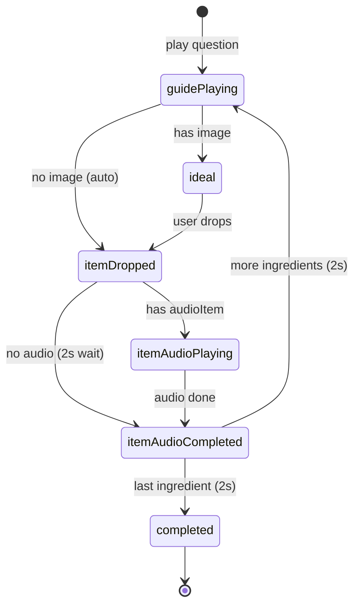

# Tea Making Tutorial

Interactive lesson where the learner follows spoken instructions, drags ingredients into the teapot, hears pronunciation, and completes the lesson with celebration audio and visuals.

**Entry point:** `KitchenPage` (`lib/src/features/lessons/templates/tea_making/pages/kitchen_page.dart`)
**State machine:** `TutorialBloc` (`lib/src/features/lessons/templates/tea_making/bloc/`)
**Lesson type:** `tea_making` (`TeaMakingLessonContent` in `lib/src/features/lessons/models/lesson.dart`)

---

## Overview

The tutorial is a linear, step-based flow:

1. Play the lesson introduction audio.
2. Show the **Huncha** (“हुन्छ”) button; on tap, play confirmation audio and start the ingredient loop.
3. For each ingredient: play a **question** (guide audio), then either wait for a drag or auto-process instruction-only items.
4. On drop: show outline on the stove, play pronunciation (or a fixed pause), show the Nepali label, mark the ingredient complete, wait 2 seconds, then advance.
5. On the last ingredient: show checkmark, wait, then play **tea ready** sound while showing leopard + confetti at the same time.

All sequencing and audio timing live in `TutorialBloc`. `KitchenPage` is a thin UI layer driven by `TutorialStatus` and state fields.

---

## Architecture

```
┌─────────────────────────────────────────────────────────────┐
│                      KitchenPage (UI)                        │
│  BlocProvider → TutorialBloc                                 │
│  BlocBuilder  → Stack: tray, stove, drag target, labels,     │
│                 leopard, huncha, confetti                    │
└──────────────────────────┬──────────────────────────────────┘
                           │ TutorialEvent / TutorialState
┌──────────────────────────▼──────────────────────────────────┐
│                      TutorialBloc                            │
│  State machine, audio sequencing, ingredient advancement     │
└──────────────────────────┬──────────────────────────────────┘
                           │
┌──────────────────────────▼──────────────────────────────────┐
│              AudioPlayerServiceImpl                          │
│  Cached network audio and onPlayerComplete stream            │
└─────────────────────────────────────────────────────────────┘
```

| Layer | Responsibility |
|--------|----------------|
| `TutorialBloc` | Status transitions, audio await, index advancement, completion |
| `KitchenPage` | Layout, drag/drop, conditional widgets from status |
| `AudioPlayerService` | Play/stop/cache; single completion listener per play |
| `TeaMakingLessonContent` | CMS/JSON lesson payload |

---

## Lesson data (`TeaMakingLessonContent`)

JSON uses snake_case (`fieldRename: FieldRename.snake`).

| Field | JSON key | Purpose |
|--------|-----------|---------|
| `audioInstruction` | `audio_instruction` | Opening narration |
| `teapotVapour` | `teapot_vapour` | Fallback image on stove when item has no outline |
| `stoveImage` | `stove_image` | Stove SVG at bottom |
| `abaPaniUmalaSound` | `aba_pani_umala_sound` | Huncha confirmation audio |
| `teaReadySound` | `tea_ready_sound` | Plays when lesson completes |
| `leopardTakingTeaTb` | `leopard_taking_tea_tb` | Completion leopard (tablet) |
| `leopardTakingTeaMb` | `leopard_taking_tea_mb` | Completion leopard (mobile) |
| `ingredients` | `ingredients` | Ordered list of `Item` steps |

### Per-ingredient `Item` fields used

| Field | Role |
|--------|------|
| `order` | Sort key when lesson starts |
| `image` | Tray icon; **empty** = instruction-only (no drag) |
| `imageOutline` | SVG shown on stove after drop |
| `nameNp` / `nameEn` | Label and drop matching |
| `question` | Guide audio URL for “what do we add next?” |
| `audioItem` | Pronunciation after drop |

---

## Ingredient types

Helpers in `tutorial_bloc.dart`:

```dart
bool ingredientHasImage(Item item) => item.image.trim().isNotEmpty;

bool ingredientHasPronunciation(Item item) {
  final audio = item.audioItem?.trim();
  return audio != null && audio.isNotEmpty;
}
```

| Type | `image` | Tray | Drag | After question |
|------|---------|------|------|----------------|
| **Draggable** | non-empty | Visible | Only when `status == ideal` and `currentIndex` matches | User drops on `DragTarget` |
| **Instruction-only** | empty | Hidden | N/A | `processInstructionOnlyStep` auto-runs completion |

Instruction-only steps are dispatched as a **separate event** (`TutorialEvent.processInstructionOnlyStep`) so multiple ingredients are not chained inside one async handler (avoids duplicate checkmarks and `emit after handler completed` issues).

---

## State machine (`TutorialStatus`)

```
initial
  → instructionPlaying → instructionCompleted (show Huncha)
  → hunchaPressed → hunchaAudioPlaying → hunchaAudioCompleted
  → [per ingredient loop]
       guidePlaying → ideal (draggable) OR processInstructionOnlyStep
       → itemDropped → itemAudioPlaying? → itemAudioCompleted
       → (2s) → next guidePlaying OR completed
  → completed (leopard + confetti + teaReadySound)
```

### State fields (`TutorialState`)

| Field | Purpose |
|--------|---------|
| `status` | Current phase (see enum in `tutorial_state.dart`) |
| `content` | Full lesson; ingredients sorted by `order` on start |
| `currentIndex` | Active ingredient index in `ingredients` |
| `currentItem` | Item for current guide/drag step |
| `lastDroppedItem` | Last processed item (label + stove image) |
| `completedIngredientIndices` | `Set<int>` of finished indices (checkmarks) |
| `showHunchButton` | Huncha visibility after intro |

---

## Detailed flow

### 1. Lesson start

**Event:** `TutorialEvent.started(content)`

- Sort `ingredients` by `order`.
- Emit `instructionPlaying`, play `audioInstruction` via `_playAudioAwait`.
- Emit `instructionCompleted`, `showHunchButton: true`.

### 2. Huncha button

**Event:** `TutorialEvent.hunchaButtonPressed`

- Hide button, play `abaPaniUmalaSound` when present.
- Then `_playGuideForCurrentItem` for `currentIndex == 0`.

### 3. Guide (question) audio

**Method:** `_playGuideForCurrentItem`

- Set `currentItem`, status `guidePlaying`.
- If `question` is empty, skip straight to `_onGuideAudioCompleted`.
- Otherwise play question URL and continue.

**After guide:** `_onGuideAudioCompleted`

- If item has **no image** → `add(processInstructionOnlyStep)`.
- Else → `ideal` (enable drag for current index only).

### 4. Item completion (drop or auto)

**Events:** `itemDropped` or `processInstructionOnlyStep` → `_processItemCompletion`

1. `itemDropped` + `lastDroppedItem`.
2. If pronunciation exists → `itemAudioPlaying` + play `audioItem`.
3. Else → wait **2 seconds** (`_completionDelay`).
4. `_finishIngredientStep`:
   - Add `currentIndex` to `completedIngredientIndices`.
   - Status `itemAudioCompleted`.
   - If more ingredients: wait 2s, increment `currentIndex`, play next guide.
   - If done: wait 2s, `_completeLesson`.

### 5. Lesson completion

**Method:** `_completeLesson`

1. Emit `status: completed` (and `currentIndex` if provided).
2. `await Future.delayed(Duration.zero)` so leopard/confetti can paint.
3. Start `teaReadySound` with `unawaited(_playTeaReadySound)` — does **not** block the UI on audio length.

Leopard images are **precached** in `KitchenPage.initState` via `MediaCacheManager` so the SVG is ready when completion fires.

---

## UI behavior (`KitchenPage`)

### Top tray

- Shown while `status != completed`.
- Only ingredients with `ingredientHasImage` are rendered.
- **Draggable** only when `status == ideal` && `currentIndex == index`.
- **Checkmark** when `completedIngredientIndices.contains(index)`.

### Stove / drop zone

- `DragTarget` active only in `ideal` for the current draggable item.
- Stack order: dropped outline (`DraggedItem`) below, transparent `DragTarget` on top (fixes hits blocked by overlay).
- Dropped image: `imageOutline` → else `image` → else `teapotVapour`.

### Label (`LabelDisplay`)

Visible when `lastDroppedItem != null` and status is one of:

- `itemDropped`
- `itemAudioPlaying`
- `itemAudioCompleted`

Hidden when `guidePlaying` starts (next question). Stays through pronunciation and the 2s pause before the next question.

### Drag indicator

Code-drawn arrow from first visible ingredient to stove, only on first draggable step in `ideal`.

### Completion

When `status == completed`:

- Full-screen leopard (`leopardTakingTeaMb` / `leopardTakingTeaTb` by platform).
- Lottie confetti (`assets/lottie/confetti_1.json`).
- Tap leopard area to pop navigator.
- Top ingredient tray hidden.

### Huncha

`HunchaButton` listens to `showHunchButton`; dispatches `hunchaButtonPressed` on tap.

---

## Audio system

### `AudioPlayerServiceImpl`

- Stops previous playback before each `play`.
- Caches network files with `MediaCacheManager`.
- Exposes a **broadcast** `onPlayerComplete` stream with one native listener per play.

### `_playAudioAwait` (bloc)

Used for instruction, huncha, guide, and pronunciation — anything that must block the state machine until finished:

1. Cancel any prior bloc subscription.
2. `stop()` the player.
3. Subscribe once to `onPlayerComplete`.
4. Run `play()`.
5. Wait for completion (30s timeout).
6. Cancel subscription in `finally`.

**Tea ready sound** intentionally does **not** use `_playAudioAwait`, so the completed UI and audio start together.

---

## Events reference

| Event | When fired |
|--------|------------|
| `started(content)` | `KitchenPage` creates bloc |
| `hunchaButtonPressed` | User taps Huncha |
| `itemDropped(item)` | Valid drop on stove |
| `processInstructionOnlyStep` | After guide for no-image item |
| `itemAudioCompleted` | Legacy; delegates to `_finishIngredientStep` |
| `instructionAudioCompleted`, `hunchaAudioCompleted`, `guideAudioCompleted` | Mostly internal chaining |
| `ideal`, `completed` | Available; completion usually via bloc |

---

## File structure

```
lib/src/features/lessons/templates/tea_making/
├── README.md                   ← this document
├── bloc/
│   ├── tutorial_bloc.dart      ← state machine + audio
│   ├── tutorial_event.dart
│   ├── tutorial_state.dart
│   └── tutorial_bloc.freezed.dart
├── pages/
│   └── kitchen_page.dart       ← main UI
└── widgets/
    ├── leopard_with_tea.dart
    ├── dragged_item.dart
    ├── huncha_button.dart
    └── ingredient.dart

lib/src/features/lessons/
├── models/lesson.dart          ← TeaMakingLessonContent
└── widgets/label_display.dart

lib/src/core/services/
├── audio_player_service.dart
└── media_cache_manager.dart
```

---

## Design decisions and fixes

Problems addressed during implementation:

| Issue | Cause | Fix |
|--------|--------|-----|
| Drag never accepted | `DragTarget` under overlay / wrong `status` check | Reorder stack; drag only in `ideal` |
| Multiple checkmarks | Stacked `onPlayerComplete` listeners + chained awaits | `_playAudioAwait` one-shot; `_finishIngredientStep` guard; separate event for instruction-only |
| `emit after handler completed` | Async work not awaited in `on<TutorialEvent>` | `async` handler with `await` per branch |
| Label vanished too soon | UI only watched `itemDropped` / `itemAudioPlaying` | Also show during `itemAudioCompleted` until `guidePlaying` |
| `teaReadySound` silent | Stale completion + blocking await | `stop()` before play; emit completed then unawaited play |
| Leopard after sound | Handler blocked on `await _playAudioAwait(teaReadySound)` | Emit completed, `Duration.zero` yield, fire-and-forget audio; precache leopard URLs |
| Last ingredient no check | Index not advanced before complete | `currentIndex: nextIndex` in `_completeLesson` |

### Guards

- `_isFinishingIngredientStep` — prevents re-entrant `_finishIngredientStep`.
- `completedIngredientIndices.contains(completedIndex)` — skip duplicate completion for same index.
- `_isCurrentItem` — drop must match `currentItem` by `nameEn` / `nameNp`.

---

## Timing constants

| Delay | Value | Where |
|--------|--------|--------|
| Post-ingredient pause | 2s | `_completionDelay` in `_finishIngredientStep` and no-pronunciation path |
| Audio await timeout | 30s | `_playAudioAwait` |
| UI yield before tea ready | `Duration.zero` | `_completeLesson` |

---

## Testing checklist

- [ ] Intro audio plays; Huncha appears after.
- [ ] Huncha audio plays; first question starts.
- [ ] Only current ingredient drags in `ideal`; wrong item rejected.
- [ ] Instruction-only ingredient: no tray slot, auto-advances after question.
- [ ] Drop shows outline; pronunciation plays; `nameNp` label stays until next question.
- [ ] No pronunciation: 2s label/outline, then checkmark and next question.
- [ ] One checkmark per ingredient; last ingredient gets checkmark before completion.
- [ ] Completion: leopard + confetti + `teaReadySound` at the same time.
- [ ] Hot restart after bloc/audio changes (Flutter does not always hot-reload bloc logic).

---

## Related code

- Short template note: `lib/src/features/lessons/templates/tea_making/README.md`
- Lesson union: `LessonContent.teaMaking` in `lesson.dart`
- Optional global precache: `_precacheTeaMakingLessonContent` in `media_cache_manager.dart` (currently commented)

---

## Mermaid: ingredient loop


